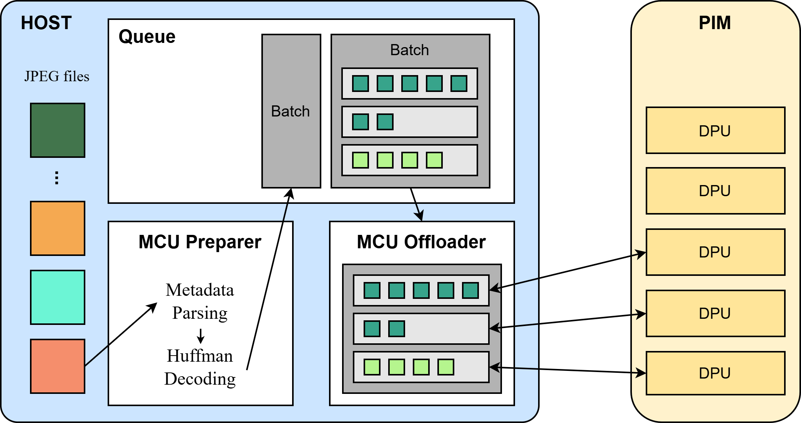
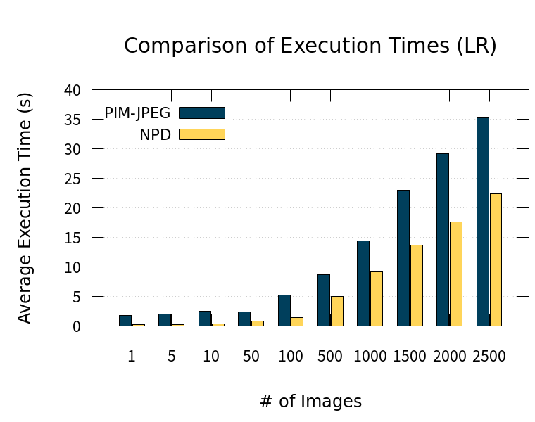
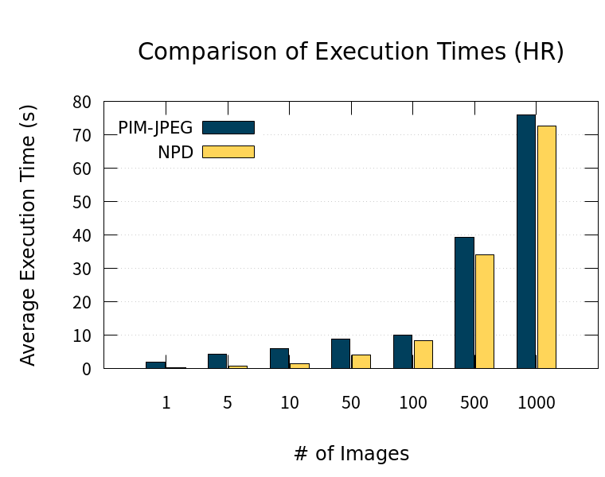
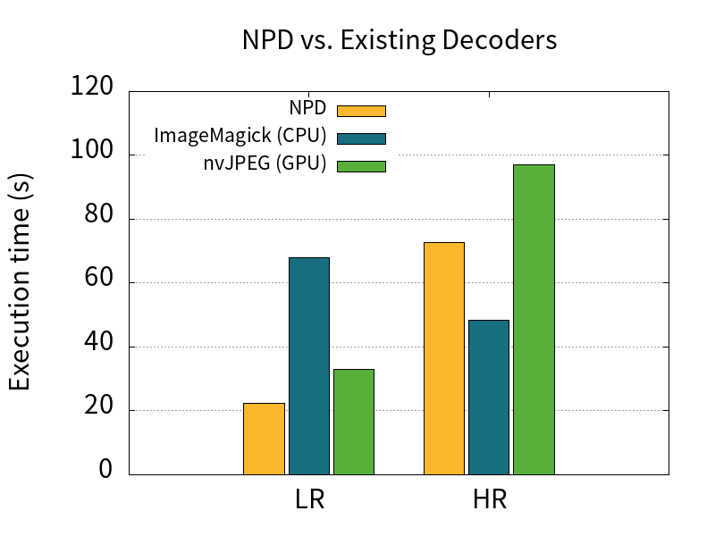

# NPD (Novel PIM Decoder)
**NPD(Novel PIM Decoder)** is a JPEG decoder designed to runs on PIM-integrated systems. It can decode massive, high-resolution JPEG images by flexibly utilizing thousands of DPU cores.

## Building
Before building this project, the following software must be installed on your system:
- [UPMEM SDK](https://sdk.upmem.com/)
- `cmake`, `make`
- GCC compiler

A Makefile is provided, and executables will be created in the `bin/` directory. Use the following commands to build the project:

```
git clone https://github.com/jeun-990806/NPD.git
cd NPD
make
```

### Variables in Makefile
There are configurable options available before building, defined as variables in the Makefile. You can adjust the number of hardware threads and how NPD distributes image data by modifying the Makefile.
* `NUM_TASKLETS` — Set the number of tasklets.
* `MAX_MCU_PER_DPU` — Set the number of MCUs processed by each DPU.

## Usage
### Convert JPEG Images to BMP
NPD takes one or more JPEG file paths as command-line arguments. It creates BMP files from the input JPEGs, and the output files are generated in the same directories as the originals.
```
./bin/decoder <jpeg_image_1> ...
```

### Performance Profiling
After execution, a performance profile will be printed to the console. Example:

```
Profiles:
End-to-end execution time: 0.282225s
Breakdowns: 
 - Queue waiting time: 0.109344s
 - CPU-to-DPUs transfer time: 0.0377356s
 - DPU execution time: 0.0288185s
 - DPUs-to-CPU transfer time: 0.0408663s
 - BMP write time: 0.0100065s
 - Total offload times: 1
```

## Design


NPD utilizes two threads and a single queue to efficiently distribute JPEG image data and decoding tasks. The image data is divided into MCUs (Minimum Coded Units), which are processed in parallel across multiple DPUs. This allows high-resolution image decoding to be offloaded despite the limited local DRAM capacity of each DPU. Decoding tasks are categorized based on their characteristics into CPU-suitable tasks (e.g., metadata parsing, Huffman decoding) and parallelizable tasks. The latter are offloaded to the DPUs, reducing overall overhead and enabling efficient decoding performance.

## Performance Evaluation
We evaluate NPD using two datasets: LR (Low-Resolution) and HR (High-Resolution).
The LR dataset consists of 2,500 randomly selected images from [ILSVRC2012](https://www.image-net.org/challenges/LSVRC/2012/), while the HR dataset is a subset of the [Clothing dataset](https://www.kaggle.com/datasets/agrigorev/clothing-dataset-full) that can be decoded by all baselines.

<p>
  
  
</p>

We compare NPD with an existing PIM-based JPEG decoder, [PIM-JPEG](https://github.com/UBC-ECE-Sasha/PIM-JPEG/). Execution time is reduced in all cases, with a particularly significant reduction observed when decoding a large number of small images.



We also compare NPD with other existing JPEG decoders. (**Note**: nvJPEG was tested on a GPU without hardware decoding support, and the implementation used was from NVIDIA’s [CUDALibrarySamples](https://github.com/NVIDIA/CUDALibrarySamples).) When decoding a large number of small images, both NPD and nvJPEG outperform ImageMagick, whereas ImageMagick achieves better performance when decoding fewer large images.

## Citation
```
@conference{npd_ipdps25,
  title   = {{Enhanced JPEG Decoding using PIM Architectures with Parallel MCU Processing}},
  author  = {Jieun Kim and Dukyun Nam},
  booktitle = {Proceedings of the IEEE International Parallel & Distributed Processing Symposium},
  year    = {2025},
  month   = {June}
}
```